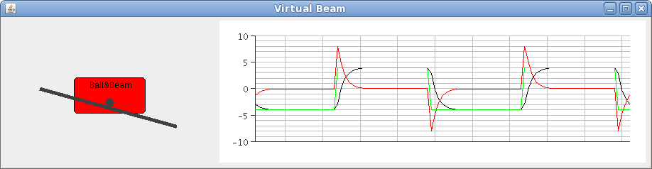
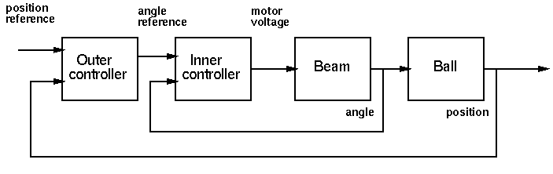

========================================================================
                           Real-Time Systems
========================================================================

Exercise 3: Controller Implementation (2012 Version)         
====================================================

If you have not done the Buttons exercise from Exercise 2, we suggest
that you start by finishing it.

The aim of exercise three is:

* To learn how to best implement periodic threads in Java.
* To learn how to implement PI and PID controllers.

Most of the exercise concerns control of the ball and beam process.

.. image:: img/bom.gif

Instead of using the real process you will use a virtual, simulated ball
and beam process. A Swing-based GUI to the controllers is available. A
reference signal generator class is also provided. During Laboratory 1
the real ball and beam process will be used.

Periodic Threads
----------------

So far you have implemented periodic tasks only using sleep, i.e. as::

  int h; // h in milliseconds
  while (true) {
    periodicActivity();
    try {
        sleep(h);
    } catch (InterruptedException x) {
    }
  }

Where h is the desired period in milliseconds. The problem with this
approach is that it does not take the execution time of the periodic
activity into account. The execution time includes the actual execution,
which may be time-varying due to, e.g., caches, data-dependent
operations, and the time when the thread is suspended by other threads.

A better, although far from perfect, way to implement periodic threads
is the following::

  long h; // Sampling interval
  long duration;
  long t = System.currentTimeMillis();
  while (true) {
    periodicActivity();
    t = t + h;
    duration = t - System.currentTimeMillis();
    if (duration > 0) {
      try {
        sleep(duration);
      } catch (InterruptedException x) {
      }
    }
  }

1. Why is this approach better than the rirst? Why is it still not
   perfect?

In the following you should use this approach as soon as you implement
periodic controller tasks.

Control of the Beam Process
---------------------------

In this exercise your task is to implement a PI controller and use it to
control the angle of the ball and beam process, i.e., without any ball.
The controller should be split up in two parts: the class ``PI`` which
only contains the basic PI algorithm and the class ``BeamRegul`` which
implements the control of the beam process with the use of a PI
controller.

For the implementation you should use two predefined classes:
``PIParameters`` containing the parameters of a PI controller and
``PIGUI`` that implements a graphical user interface for the PI through
which you can change controller parameters.

Class ``PI``
~~~~~~~~~~~~
The PI controller should be implemented in the class PI as a monitor,
i.e., a passive object with only synchronized methods.

Class ``PIGUI``
~~~~~~~~~~~~~~~

The ``PIGUI`` class provides a Swing ``JFrame`` through which you can
type in new values for the PI-parameters. If an invalid entry is made,
e.g. a non-number, the change is ignored. In order to make it possible
to change several parameters at the same time, a change does not take
place until the Apply button has been pressed. The integratorOn is set
to false if Ti is set to 0.0. The PI parameters in PIGUI get their
initial values set through the constructor of PIGUI, which has the
signature::

  public PIGUI(PI PIReference, PIParameters initialPar, String name);

2. Implement the PI class using the already presented interface. Use
   forward Euler approximation for the discretization of the integral
   part. The PI algorithm is available in the slides from `Lecture 8`_
   Write a small dummy main method that creates an instance of the
   class.  The files that you need are PIGUI.java and PIParameters.java.

.. _Lecture 8: http://www.control.lth.se/user/FRTN01/L8_10_Multi.pdf

* Think through which variables that need to be saved between the calls
  to ``calculateOutput`` and ``updateState``.

* Set the initial parameter values in the constructor. Here you also
  instantiate ``PIGUI`` with the initial parameters as an argument.

Class ``BeamRegul``
~~~~~~~~~~~~~~~~~~~

``BeamRegul`` is the controller thread that implements the control of
the beam process through the use of the ``PI`` class. The class
``ReferenceGenerator`` provides the reference signal with the method::

  public synchronized double getRef();

The ``ReferenceGenerator`` generates a square-wave signal. It has a GUI
through which the amplitude and period (in seconds) can be changed.

* Implement ``BeamRegul`` by extending ``Thread``. The IO interface to
  the virtual process uses the same approach as in the Buttons exercise.
  Assume that the max/min control signal is 10(-10) V.

The class ``Beam`` is a simulated "virtual" ball and beam process
without any ball. It shows a plotter and an animation of the process.

4. Compile and run the system, The files that you need are Beam.java
   Main.java and ReferenceGenerator.java. You also need the
   virtualsimulator.jar archive which must be included in the classpath
   in the same way as in the Buttons exercise.

5. Start with a pure P-controller. Test what happens for different
   values of K. Explain what happens for large values of K (> 10). How
   does this compare to reality?

6. Add integral action. Is it a good idea (the beam is modeled as a pure
   integrator)?

7. With your current solution it is most likely possible for the
   parameters to become updated between calculate Output and
   updateState. Since both these calls are needed to execute the
   controller one could argue that this should be prevented. Modify your
   code so that this is prevented. Hint: Use a synchronized block. Which
   object should you synchronize on? Remember that Java synchronized
   locks are reentrant.

Cascade Control of the Ball and Beam Process
============================================

.. IMPORTANT::
  This exercise is a preparatory exercise that must be done in order to
  be allowed to do Laboratory 1. No solution is available.

The next task is to implement a controller for the entire `Ball and Beam
Process`_ (with the Ball).

.. _Ball and Beam Process: http://www.control.lth.se/previouscourse/FRTN01/Exercise3_12/ballandbeammodel.pdf

The control structure that you should use is a cascade controller. This
structure is suitable when an intermediate process output is available,
that lies between the process input and the process output that you want
to control. In the ball and beam process we want to control the position
of the ball.  However, we also have access to the angle of the beam. In
a cascade controller the intermediate process output is used to close an
inner control loop, according to the Figure below:

The output from the outer controller now becomes the reference for the inner controller. The advantages of a cascaded controller are that:

* Disturbances entering in the first part of the process can be
  compensated for faster.

* The inner feedback loop improves the overall goal by simplifying the
  total dynamics.

When a cascade structure is used it is common to only have integral
action in the outer loop. When we use cascaded control on the ball and
beam process we use the same sampling interval for both controllers, and
implement them in a single periodic thread. It is also quite common to
use a faster sampling interval for the inner controller. When
implementing the two loops in a single controller thread it is important
to minimize the computational delay (control delay, latency) from the
sampling of the position to the generation of the control signal.

8. Now you should implement a controller for the Ball and Beam process.
   Name the class ``BeamAndBallRegul``. The class should contain two
   controllers, a PI controller for the inner loop and a PID controller
   for the outer loop.

   * The following predefined classes should be used:

     * ``PIParameters.java`` 
     * ``PIGUI.java``  
     * ``PIDParameters.java``
     * ``PIDGUI.java``
     * ``ReferenceGenerator.java``
     * ``MainBB.java``
     * ``BeamAndBall.java``

   * You should write two classes. The ``PID`` class should be modeled
     after the available ``PI`` class. The ``BeamAndBallRegul`` class
     should be modeled after the available ``BeamRegul`` class.

   * Since the ball dynamics has negative gain, positive feedback is
     needed in the outer loop. The easiest way to achieve this is to use
     a negative K.
     
     Suitable parameter ranges are:

     * Inner controller: P controller with (K=0.5-10, H=0.02-0.1)
     * Outer controller: PD controller with (K=(-0.2)-(-0.01), Td=0.5-4,
       H=same as for the inner controller, N=5-10).
     * Reference Generator: (Amp=4.0, Period=20)

   * User the following IO signals::

        // Declarations
        private AnalogSource analogInAngle;
        private AnalogSource analogInPosition;   
        private AnalogSink analogOut;
        private AnalogSink analogRef;

        // In Constructor
        analogInPosition = beam.getSource(0);
        analogInAngle = beam.getSource(1);
        analogOut = beam.getSink(0);
        analogRef = beam.getSink(1);

9. Test and tune your controller manually. Use the parameter ranges
   above.

10. *Optional*. Assume that the inner controller is a pure P-controller
    with gain K=10. The transfer function for the beam process is
    G_beam(s) = 4.4 / s. Compute the transfer function, G_inner(s), from
    angle reference to beam angle in the figure above. For design of the
    outer controller you now have a new open-loop system,
    G_inner(s)*G_ball(s), where G_ball(s) = -7 / s². Study the Nyquist
    and Bode plots of this transfer function using Matlab. Why is
    derivative action important in the outer loop? Matlab commands::

      >> K = 10;
      >> s = tf('s');
      >> Gbeam = 4.4 / s;
      >> Ginner = K*Gbeam / (1 + K*Gbeam);
      >> Gball = 7 / s^2; % assume negative controller gain
      >> nyquist(Ginner*Gball);
      >> margin(Ginner*Gball); % what are the stability margins? 

