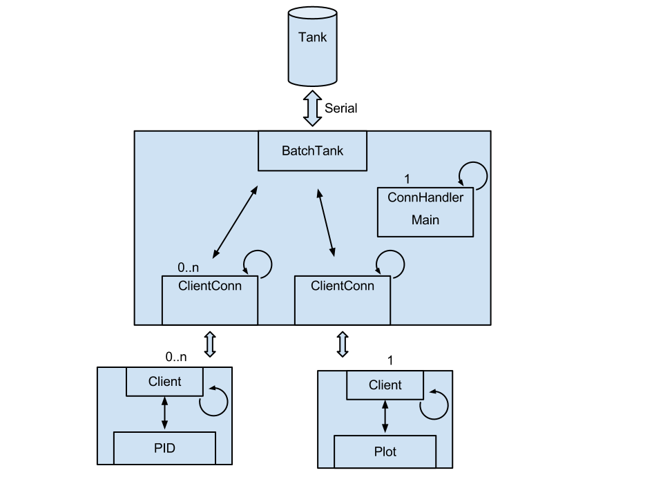

============================================
  Control of Batch Tank using Raspberry Pi
============================================
:Authors: Johan Anderholm,
          Jonathan Kämpe,
          Mikael Sahlström,
          Mikael Nilsson
:Date: Sun Nov  4 11:33:23 CET 2012
:Version: 2

Program structure
-----------------
The program will consist of the following modules:

* Server
* PID client
* Plotting client
* Disturbance client (optional)

Server
~~~~~~
The server will communicate to the batch process using a library, this
will written in C. The communication is done over a serial interface.
The actual server is implemented in C++. Wrapped around the process
library is a monitor class with a mutex for updating the process as well
as a mutex for setting variables. More or less all sensor input and
output will be available through the monitor class.

Clients will connect to the server using some network protocol (UDP or
TCP). This protocol will be defined in a seriallization language called
`protocol buffers`_. The main thread of the server spawns a thread for
each incomming client connection. This connection thread is used for
communication to and from the clients and to the process through the
thread safe monitor described above.

.. _protocol buffers: http://code.google.com/p/protobuf/

Client
~~~~~~
A client is anything that wish to communicate to the server. Generally
this is something like a PID Controller or a graphical plotting
interface. The structure of each client is specific for that type of
client and cannot be described in a general manner.

This structure allow any kinds of client to connect to the server at any
time. The process and server do not need to be restarted. Instead
clients can be restarted whenever any parameters are changed.

Operator communication
----------------------
There will be a plotting client hopefully realized using a realtime
plotting library called flot_. The communication to the server is done
as a regular client. By polling, or registring for push notification
(whatever turns out to be easiest and most effective) signal data is
retrieved and can be feed as JSON to the plotting library. Realtime
plots of sensors and signals should be possible.

.. _flot: http://www.flotcharts.org/

Any online updating of regulation parameters are done on the clients
themselves although a strictly online updating, i.e. a updation without
restart of the regulator may not be needed using this approach. A
restart of a regulator will not result in a restarted process and will
not effect other parts of the system. Parameters could probably just as
well be read from a configuration file during startup. Another approach
is to monitor the configuration files for changes and update
accordingly.

Control principles
------------------
To begin with two parameters of the process will be regulated. The
regulators will be implemented on separate Raspberry Pies. The
water level of the tank shall be kept constant against some kind of PI
regulator. After this another controller of the same type is used to
regulate the water temperature. A general purpose PID regulator will be
implemented for the regulation of these parameters.

Optionally another client which simulate some kind of chemical reaction
will be connected. In this case another regulator will be used to
regulate the simulated reaction. Whether an endothermic or exothermic
reaction will be simulated is not decided. The method of regulating
(that is using the cooler or the heater) differs but the regulator
should be the same.

Project plan
------------
The following artifacts are the result of this project.

* Final system due on December 5th.
* Final draft of a project report is due on December 6th.
* A demonstration of the system 15:15-17:0 on December 11th.
* An oral presentation 17:00-19:00 on December 7th.

Implementation
~~~~~~~~~~~~~~
The system is divided into three main parts where implementation can be
done in parallel.

* Library for communication with the process. (Mikael Nilsson)
* Process server. (Johan Anderholm & Mikael Sahlström)
* PID controller clients. (Jonathan Kämpe)

Preliminary deadline of a functional but not finished system is Monday
September 12th. Another week may be spent on polishing the results
before writing of the Project report begins.
